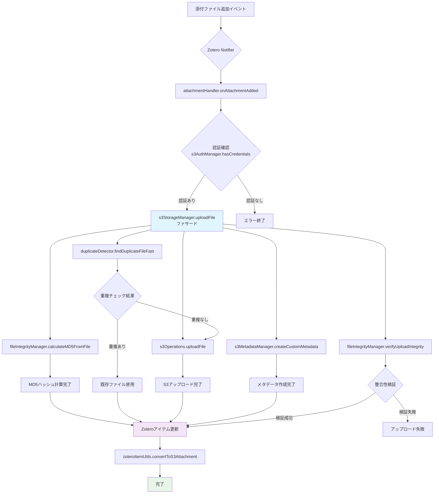
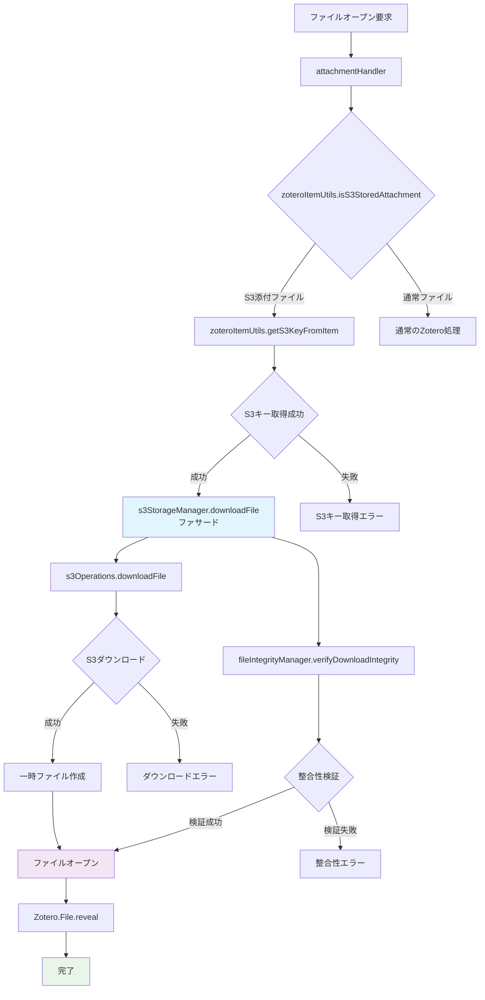
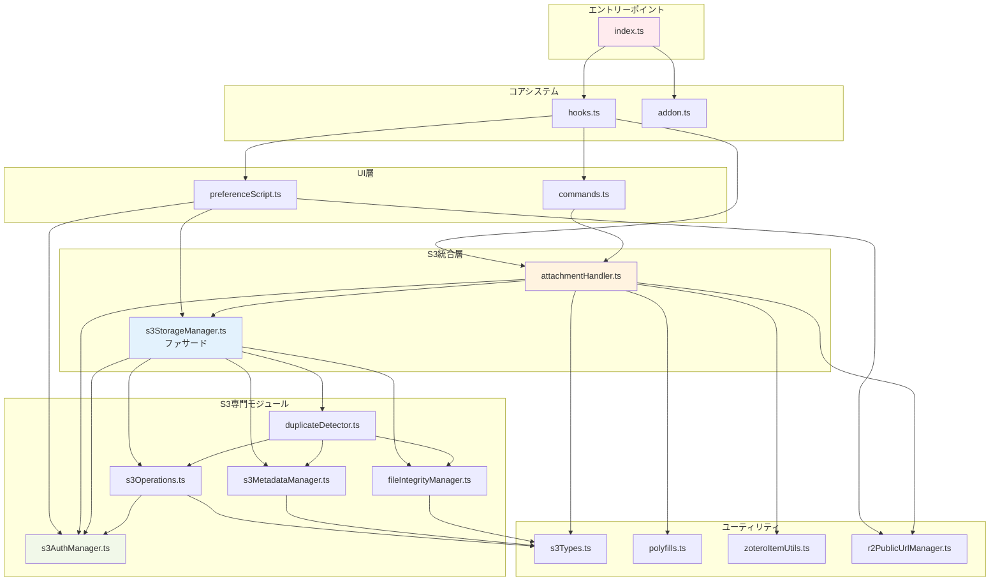

# Zotero S3 Sync プラグイン アーキテクチャ

## 概要

このドキュメントでは、Zotero 7用S3互換ストレージプラグインのアーキテクチャ、モジュール構造、依存関係を詳細に分析します。

## プロジェクト基本情報

- **プラグイン名**: Zotero S3 Sync
- **バージョン**: 0.0.1
- **対象**: Zotero 7
- **アーキテクチャ**: Bootstrap型プラグイン
- **言語**: TypeScript
- **ライセンス**: AGPL-3.0-or-later

## ディレクトリ構造

```
zotero-s3/
├── src/                           # TypeScriptソースコード
│   ├── modules/                   # コアモジュール
│   │   ├── s3AuthManager.ts      # S3認証管理（プロバイダー対応）
│   │   ├── s3StorageManager.ts   # S3ストレージ統合管理（リファクタリング版）
│   │   ├── s3Operations.ts       # S3基本操作（CRUD）
│   │   ├── s3Types.ts            # S3関連型定義・共通関数・ユーティリティ
│   │   ├── s3MetadataManager.ts  # S3メタデータ管理
│   │   ├── fileIntegrityManager.ts # ファイル整合性チェック・MD5計算
│   │   ├── duplicateDetector.ts  # 重複ファイル検出
│   │   ├── polyfills.ts          # Web APIポリフィル（AbortController等）
│   │   ├── zoteroItemUtils.ts    # Zoteroアイテム操作ユーティリティ
│   │   ├── attachmentHandler.ts  # 添付ファイル処理ハンドラー（リファクタリング版）
│   │   ├── deletionHandler.ts    # 削除処理専用ハンドラー（新規追加）
│   │   ├── notifier.ts           # Zotero Notifier管理・S3キャッシュ
│   │   ├── preferenceScript.ts   # 設定画面スクリプト・設定登録
│   │   ├── commands.ts           # ユーザーコマンド・手動操作
│   │   ├── r2PublicUrlManager.ts # 【レガシー】Cloudflare R2公開URL管理（後方互換性のため保持）
│   │   ├── r2/                   # Cloudflare R2関連モジュール（関心事分離）
│   │   │   ├── index.ts         # 統合エクスポート・レガシー互換性
│   │   │   ├── r2Utils.ts       # 共通ユーティリティ
│   │   │   ├── r2Settings.ts    # 設定管理
│   │   │   └── r2UrlGenerator.ts # URL生成
│   │   └── examples.ts           # サンプル機能（非使用）
│   ├── utils/                     # ユーティリティ
│   │   ├── ztoolkit.ts           # Zoteroツールキット初期化
│   │   ├── locale.ts             # 国際化
│   │   ├── prefs.ts              # 設定ヘルパー
│   │   └── window.ts             # ウィンドウヘルパー
│   ├── types/                     # 型定義
│   ├── hooks.ts                   # プラグインライフサイクル（大幅簡素化）
│   ├── addon.ts                   # プラグインデータ構造
│   └── index.ts                   # エントリーポイント
├── addon/                         # Zoteroプラグイン設定
│   ├── bootstrap.js              # プラグインブートストラップ
│   ├── manifest.json             # プラグインマニフェスト
│   ├── content/                   # リソースファイル
│   │   ├── preferences.xhtml     # 設定UI
│   │   ├── icons/                # アイコン
│   │   └── zoteroPane.css       # スタイル
│   ├── locale/                   # 国際化リソース
│   └── prefs.js                  # デフォルト設定
└── typings/                       # TypeScript型定義
```

## アーキテクチャ図

### システム全体図

```mermaid
architecture-beta
    group core(database)[Core System]
    group s3(cloud)[S3 Storage Layer]
    group ui(server)[User Interface]
    group commands(terminal)[Commands Layer]
    group zotero(desktop)[Zotero Integration]

    service hooks(logos:typescript)[Hooks] in core
    service addon(logos:typescript)[Addon Data] in core
    service index(logos:typescript)[Index] in core

    service auth(key)[S3AuthManager] in s3
    service storage(database)[S3StorageManager] in s3
    service operations(gear)[S3Operations] in s3
    service metadata(tag)[S3MetadataManager] in s3
    service integrity(shield)[FileIntegrityManager] in s3
    service duplicates(copy)[DuplicateDetector] in s3
    service types(file)[S3Types] in s3
    service handler(folder)[AttachmentHandler] in s3

    service prefs(monitor)[PreferenceScript] in ui
    service locale(globe)[Locale Utils] in ui
    service toolkit(wrench)[ZToolkit] in ui

    service cmdHandler(console)[Commands] in commands

    service notifier(bell)[Zotero Notifier] in zotero
    service api(api)[Zotero API] in zotero
    service bootstrap(gear)[Bootstrap] in zotero

    index:R --> L:hooks
    hooks:B --> T:addon
    hooks:R --> L:auth
    hooks:R --> L:handler
    hooks:B --> T:prefs
    hooks:R --> L:cmdHandler

    handler:R --> L:auth
    handler:R --> L:storage
    storage:R --> L:operations
    storage:R --> L:metadata
    storage:R --> L:integrity
    storage:R --> L:duplicates
    operations:T --> B:auth
    operations:B --> T:types
    metadata:B --> T:types
    integrity:B --> T:types
    duplicates:R --> L:operations
    duplicates:R --> L:metadata
    duplicates:R --> L:integrity

    prefs:R --> L:auth
    prefs:R --> L:storage

    cmdHandler:R --> L:handler

    hooks:B --> T:notifier
    handler:B --> T:api
    bootstrap:R --> L:index
```



## モジュール詳細分析（リファクタリング完了）

### 1. コアシステム (Core System)

#### `src/index.ts` - エントリーポイント

```typescript
// 責務: プラグインの初期化とグローバル設定
// 依存関係: addon.ts, hooks.ts
```

#### `src/hooks.ts` - ライフサイクル管理（大幅簡素化） ⭐ **リファクタリング**

```typescript
// 責務: プラグインのライフサイクル（startup, shutdown等）とイベントディスパッチ
// 主要機能:
// - Zotero Notifierの登録
// - S3機能の初期化
// - 設定画面の登録
// - イベントハンドリング（簡素化されたディスパッチャー）

// リファクタリング内容:
// ❌ 旧方式: onNotify関数内に150行の複雑な削除処理
// ✅ 新方式: DeletionHandlerへの処理委譲で10行に削減
// ✅ handleAddEvent関数の分離
// ✅ 単一責任原則の適用

// 主要改善点:
// - 366行 → 216行（150行削減）
// - 複雑なネスト構造の解消
// - ガードクラウズパターンの適用
// - エラーハンドリングの改善

// ⚠️ 注意: 実際の業務ロジックは含まず、イベントの振り分けのみを行う
```

#### `src/addon.ts` - データ構造

```typescript
// 責務: プラグインのデータ構造とAPIインターフェース定義
```

### 2. S3ストレージレイヤー (S3 Storage Layer) - リファクタリング済み ✅

#### `src/modules/s3Types.ts` - 型定義・共通関数・ユーティリティ ⭐ **拡張**

```typescript
// 責務: S3関連の型定義、エラークラス、共通ユーティリティ関数
// 主要機能:
// - S3Error, UploadProgress, FileIntegrity, S3CustomMetadata等の型定義
// - getFileName(), guessContentType()等の共通ヘルパー関数
// - joinPath(), generateS3Key()等のユーティリティ関数
// - S3MetadataHelper（下位互換性のため）

// 新規追加された関数:
// - joinPath(dir: string, fileName: string): string
// - generateS3Key(itemID: number, fileName: string): string

// 🆕 Ignore Content Type機能（新規追加）:
// - parseIgnoreContentTypes(ignoreContentTypesString: string): string[]
// - shouldIgnoreFile(filePath: string, ignoreContentTypes: string[]): boolean
// - getIgnoreContentTypes(): string[]

// 主要型定義:
interface S3CustomMetadata extends Record<string, string> {
  originalfilename: string;
  uploaddate: string;
  md5hash: string;
  filesize: string;
}

interface UploadProgress {
  loaded: number;
  total: number;
  percentage: number;
}

interface FileIntegrity {
  md5Hash: string;
  size: number;
  isValid: boolean;
}

// 使用目的: S3統合、ファイル操作、コンテンツタイプ判定、除外処理
```

#### `src/modules/polyfills.ts` - Web APIポリフィル 🆕

```typescript
// 責務: Zotero環境で利用できないWeb APIのポリフィル実装
// 主要機能:
// - AbortControllerPolyfill: キャンセル可能な操作のサポート
// - AbortSignalPolyfill: シグナル管理
// - getSafeAbortController(): 環境に応じた適切なAbortController取得

// 主要クラス:
export class AbortControllerPolyfill {
  signal: AbortSignalPolyfill;
  abort(): void;
}

export class AbortSignalPolyfill {
  aborted: boolean;
  addEventListener(type: string, listener: () => void): void;
  removeEventListener(type: string, listener: () => void): void;
}

// 使用目的: S3操作のキャンセル機能、ネットワーク要求の中断対応
```

#### `src/modules/zoteroItemUtils.ts` - Zoteroアイテム操作ユーティリティ 🆕

```typescript
// 責務: Zoteroアイテムと添付ファイルの操作ユーティリティ
// 主要機能:
// - S3添付ファイル判定・メタデータ取得
// - 添付ファイルのS3リンクモード変換
// - Content-Type推測

// 主要関数:
export function isS3StoredAttachment(item: Zotero.Item): boolean;
export function getS3KeyFromItem(item: Zotero.Item): string | null;
export function convertToS3Attachment(
  attachmentItem: Zotero.Item,
  s3Url: string,
  fileName: string,
): Promise<void>;
export function getS3AttachmentMetadata(
  item: Zotero.Item,
): S3AttachmentMetadata;

// 実装方法の変更:
// ❌ 旧方式: 親アイテムのextraフィールドにS3 URL保存
// ❌ 中間方式: 添付ファイルのattachmentURLに直接S3 URL設定
// ✅ 新方式: Zotero.Attachments.linkFromURLでweb linkアタッチメント作成
// ✅ 元の添付ファイルを削除し、新しいS3 web linkに置換
// ✅ タイトルに[S3]マークを追加
// ✅ Content-Typeを自動設定

// 使用目的: Zotero統合、添付ファイルメタデータ管理、S3 web link変換
```

#### `src/modules/s3StorageManager.ts` - 統合S3ストレージ管理 ⭐ **リファクタリング**

```typescript
// 責務: S3ストレージ操作の統合管理（ファサードクラス）
// デザインパターン: シングルトン + ファサード
// 主要機能:
// - 他の専門クラスを組み合わせた統合的なS3操作
// - 静的メソッドによる外部API提供
// - インスタンスメソッドによる内部実装

// 依存関係（組み合わせ）:
// - S3Operations: 基本CRUD操作
// - FileIntegrityManager: 整合性検証
// - S3MetadataManager: メタデータ管理
// - DuplicateDetector: 重複検出
// - S3AuthManager: 認証情報

// 主要メソッド:
static async uploadFile(filePath: string, s3Key: string, onProgress?: UploadProgress, checkDuplicates?: boolean): Promise<UploadResult>;
static async downloadFile(s3Key: string, downloadPath: string, onProgress?: UploadProgress, verifyIntegrity?: boolean): Promise<void>;
static async deleteFile(s3Key: string): Promise<void>;
static async getFileMetadata(s3Key: string): Promise<S3FileMetadata | null>;

// リファクタリング内容:
// - 865行のモノリシックコードを325行のファサードクラスに圧縮
// - 機能別に専門クラスに分割
// - コードの再利用性と保守性を大幅に向上
```

#### `src/modules/s3Operations.ts` - S3基本操作 🆕

```typescript
// 責務: S3の基本的なCRUD操作
// 主要機能:
// - S3Client初期化・接続テスト
// - ファイルアップロード（マルチパート対応）
// - ファイルダウンロード（ストリーミング）
// - ファイル削除
// - メタデータ取得
// - ファイル一覧取得

// 依存関係:
// - AWS SDK v3 (@aws-sdk/client-s3, @aws-sdk/lib-storage)
// - S3AuthManager (認証情報管理)
// - S3Types (型定義)

// 主要メソッド:
async initializeClient(): Promise<void>;
async testConnection(): Promise<boolean>;
async uploadFile(s3Key: string, fileData: Uint8Array, contentType: string, metadata: S3CustomMetadata, onProgress?: UploadProgress): Promise<UploadResult>;
async downloadFile(s3Key: string, onProgress?: UploadProgress): Promise<Uint8Array>;
async deleteFile(s3Key: string): Promise<void>;
async getFileMetadata(s3Key: string): Promise<S3FileMetadata | null>;
async listFiles(prefix?: string): Promise<S3FileMetadata[]>;
```

#### `src/modules/fileIntegrityManager.ts` - ファイル整合性管理 🆕

```typescript
// 責務: ファイル整合性チェック・MD5計算
// 主要機能:
// - MD5ハッシュ計算（ファイル・バイト配列）
// - ファイル整合性検証
// - アップロード・ダウンロード後の整合性確認

// 依存関係:
// - js-md5 ライブラリ（MD5計算）
// - S3Types (型定義)

// 主要メソッド（静的）:
static async calculateMD5FromFile(filePath: string): Promise<string>;
static async calculateMD5FromBytes(data: Uint8Array): Promise<string>;
static async verifyFileIntegrity(filePath: string, expectedMD5?: string): Promise<FileIntegrity>;
static async verifyDownloadIntegrity(downloadPath: string, expectedMD5: string): Promise<void>;
static async verifyUploadIntegrity(s3Key: string, expectedMD5: string, actualMD5?: string): Promise<void>;
```

#### `src/modules/s3MetadataManager.ts` - S3メタデータ管理 🆕

```typescript
// 責務: S3カスタムメタデータの作成・アクセス・管理
// 主要機能:
// - S3オブジェクトメタデータの作成
// - メタデータからの情報抽出
// - R2/S3キー正規化対応

// 依存関係:
// - S3Types (型定義)

// 主要メソッド（静的）:
static createCustomMetadata(filePath: string, fileSize: number, md5Hash: string): S3CustomMetadata;
static getMD5Hash(metadata?: S3CustomMetadata): string | undefined;
static getOriginalFileName(metadata?: S3CustomMetadata): string | undefined;
static isValidMetadata(metadata?: S3CustomMetadata): boolean;
static areEqual(metadata1?: S3CustomMetadata, metadata2?: S3CustomMetadata): boolean;
```

#### `src/modules/duplicateDetector.ts` - 重複ファイル検出 🆕

```typescript
// 責務: S3内の重複ファイル検出とマッチング
// 主要機能:
// - MD5ハッシュベースの重複検出
// - ファイルサイズによる高速スクリーニング
// - 重複統計とレポート生成

// 依存関係:
// - S3Operations (ファイル一覧・メタデータ取得)
// - FileIntegrityManager (MD5計算)
// - S3MetadataManager (メタデータアクセス)

// 主要メソッド:
async findDuplicateFile(filePath: string): Promise<string | null>;
async findDuplicateFileFast(filePath: string, fileSize: number): Promise<string | null>;
async getDuplicateStatistics(): Promise<DuplicateStats>;
async getDuplicateFileGroups(): Promise<Map<string, DuplicateGroup[]>>;
```

#### `src/modules/s3AuthManager.ts` - S3認証管理（プロバイダー対応） ⭐ **完成**

```typescript
// 責務: 複数のS3互換プロバイダーに対応した認証情報管理
// 主要機能:
// - Amazon S3、Cloudflare R2、MinIO、カスタムS3互換ストレージの統一認証
// - プロバイダー固有設定の管理（エンドポイント、リージョン等）
// - 認証情報の暗号化保存・検証
// - 設定UI向けのヘルパー機能

// サポートプロバイダー:
STORAGE_PROVIDERS = {
  aws: { name: "Amazon S3", regionRequired: true },
  r2: { name: "Cloudflare R2", endpointRequired: true },
  minio: { name: "MinIO", endpointRequired: true },
  custom: { name: "カスタムS3互換", endpointRequired: true },
};

// 主要メソッド:
// - saveCredentials(credentials: S3Credentials): Promise<void>
// - getCompleteCredentials(): S3Credentials | null
// - validateCredentials(credentials: S3Credentials): ValidationResult
// - getProviderInfo(provider: string): ProviderInfo
```

#### `src/modules/r2PublicUrlManager.ts` - Cloudflare R2公開URL管理（リファクタリング版） ⭐ **統合リファクタリング**

```typescript
// 責務: Cloudflare R2バケットの公開URL管理とカスタムドメイン機能
// 主要機能:
// - Cloudflare APIトークン管理
// - パブリック開発URL取得・有効化
// - カスタムドメイン設定・検証・接続状態確認
// - 統合URL生成システム
// - 公開URL自動保存機能

// 🆕 統合URL生成システム（大幅リファクタリング）:
/**
 * 統合URL生成メソッド
 * @param s3Key S3キー
 * @param options 生成オプション
 * - type: "custom" | "r2dev" | "disabled" | "auto" (デフォルト: "auto")
 * - allowFallback: boolean (デフォルト: true)
 * @returns 生成されたURL
 */
static async generateUrl(s3Key: string, options = {}): Promise<string>

// 🔄 統合により廃止予定のメソッド（@deprecated）:
// - generatePublicUrl() → generateUrl(s3Key, { type: "auto" })
// - generateUrlByType() → generateUrl(s3Key, { type: urlType })
// - generateDevelopmentUrl() → 削除済み（無効な形式のため）

// ✅ URL生成の優先順位（type: "auto"時）:
// 1. カスタムドメイン (https://custom.domain.com/file.pdf)
// 2. r2.dev開発URL (https://pub-abc123.r2.dev/file.pdf)
// 3. 標準アカウントURL (https://pub-{accountId}.r2.dev/file.pdf)
// 4. 汎用S3 URL（最終フォールバック）

// 🛡️ 認証チェック統合:
private static validateR2Credentials(): ValidatedCredentials | null

// 主要API統合:
interface CloudflareApiIntegration {
  getPublicDevelopmentUrl(bucketName: string): Promise<string | null>;
  enablePublicDevelopmentUrl(bucketName: string): Promise<boolean>;
  checkCustomDomainStatus(domain: string): Promise<ConnectionStatus>;
}

// 🎯 設定管理:
interface R2Settings {
  customDomain: string | null;
  autoSavePublicUrl: boolean;
  cloudflareApiToken: string | null;
}
```

### 3. Zotero統合レイヤー

#### `src/modules/attachmentHandler.ts` - 添付ファイル処理 ⭐ **リファクタリング**

```typescript
// 責務: Zotero添付ファイルとS3の連携（大幅にスリム化）
// 主要機能:
// - 添付ファイルのS3アップロード/ダウンロード
// - ファイルオープン処理
// - S3削除実行（削除判定はDeletionHandlerが担当）
// - プログレス表示・エラーハンドリング
// - Cloudflare R2パブリック開発URL対応

// 新規追加機能（責任分離）:
// - deleteS3File(): S3削除実行専用メソッド（DeletionHandlerから呼び出し）
// - onAttachmentDeleted(): @deprecated（下位互換性のため保持）

// 新規追加機能（Cloudflare R2対応）:
// - generateS3Url(): R2の場合はパブリック開発URLを自動取得
// - R2PublicUrlManagerとの連携でCloudflare API使用
// - パブリック開発URL取得失敗時のフォールバック機能

// 依存関係（新しいモジュール活用）:
// - S3StorageManager (統合S3操作)
// - S3AuthManager (認証確認)
// - R2PublicUrlManager (R2パブリック開発URL、動的インポート)
// - polyfills (AbortController)
// - zoteroItemUtils (アイテム操作)
// - s3Types (ユーティリティ関数)

// 主要メソッド:
async onAttachmentAdded(itemID: number): Promise<void>;
async uploadAttachmentToS3(item: Zotero.Item): Promise<void>;
async onAttachmentOpen(item: Zotero.Item): Promise<void>;
async deleteS3File(itemID: number, s3Key: string): Promise<void>; // 🆕 S3削除実行専用
async onAttachmentDeleted(itemID: number, s3Key?: string): Promise<void>; // @deprecated
cancelUpload(itemID: number): void;
private async generateS3Url(s3Key: string): Promise<string>;  // 🆕 R2対応

// リファクタリング内容:
// - 重複するヘルパー関数を専用モジュールに移動
// - ポリフィル・ユーティリティをインポートして使用
// - Cloudflare R2パブリック開発URL機能を統合
// - 削除処理の責任分離（判定 vs 実行）
// - コードの可読性・保守性を大幅に向上
// - 単一責任原則を適用
```

#### `src/modules/deletionHandler.ts` - 削除処理専用ハンドラー 🆕 **NEW**

```typescript
// 責務: アイテム削除・ゴミ箱移動時のS3ファイル削除処理
// 主要機能:
// - ガードクラウズパターンによる可読性向上
// - キャッシュ情報とextraDataの二重チェック
// - 添付ファイル・通常アイテム・子添付ファイルの統合処理
// - S3情報抽出と削除判定（S3削除実行はAttachmentHandlerに委譲）

// 設計パターン:
// - ガードクラウズパターン: 早期リターンによるネスト削減
// - 単一責任原則: 削除判定処理のみに特化
// - 委譲パターン: AttachmentHandler.deleteS3File()への処理委譲
// - Extract Moduleパターン: 削除判定とS3削除実行の責任分離

// 主要メソッド:
async handleDeletionEvent(event: string, numericId: number, extraData: any): Promise<void>;
private async handleCachedS3Attachment(event: string, numericId: number, cachedInfo: any): Promise<void>;
private async handleExtraDataFallback(event: string, numericId: number, extraData: any): Promise<void>;
private async handleAttachmentDeletion(event: string, numericId: number, itemData: any): Promise<void>;
private async handleRegularItemDeletion(event: string, numericId: number, itemData: any): Promise<void>;
private extractS3InfoFromAttachment(itemData: any): { isS3Attachment: boolean; s3Key: string | null };
private async deleteS3Attachment(itemID: number, s3Key: string): Promise<void>; // 委譲メソッド

// リファクタリング効果:
// ✅ hooks.tsの削除処理を150行から10行に削減
// ✅ ネストレベルを最大7層から3層に削減
// ✅ 循環的複雑度の大幅削減
// ✅ 可読性とメンテナンス性の向上
// ✅ 重複コードの完全解消

// 依存関係:
// - AttachmentHandler.deleteS3File() (S3削除実行)
// - Notifier (キャッシュ情報取得)

// 使用目的: 削除イベント処理、削除判定、コード品質向上
```

#### `src/modules/notifier.ts` - Zotero Notifier管理 ⭐ **拡張・堅牢性向上**

```typescript
// 責務: Zotero Notifierの管理とS3添付ファイル情報のキャッシュ
// 主要機能:
// - Zotero Notifierの登録・解除
// - 削除前のS3添付ファイル情報キャッシュ
// - trash/deleteイベントの監視

// 新規追加機能（削除機能修正）:
// - cacheS3AttachmentInfo(): 削除前にS3添付ファイル情報をキャッシュ
// - getCachedS3AttachmentInfo(): キャッシュされた情報の取得
// - s3AttachmentCache: S3添付ファイル情報のメモリキャッシュ

// 堅牢性向上（ガードクラウズパターン適用）:
// - processSingleAttachment(): 単一添付ファイル処理（型安全）
// - processRegularItemAttachments(): 通常アイテム子添付処理（型安全）
// - extractAndCacheS3Key(): S3キー抽出・キャッシュ（エラーハンドリング強化）
// - 包括的なnullチェックと型チェック
// - 無効なアイテムIDの早期検出
// - 関数存在チェック（isAttachment, getAttachments）
// - 配列型チェック（attachmentIDs）

// 削除イベント処理の改善:
// ❌ 旧方式: 削除後にアイテム情報を取得（既に削除済みで取得不可）
// ✅ 新方式: 削除前にS3添付ファイル情報をキャッシュし、削除後に使用
// ✅ trash/deleteイベントの両方を監視
// ✅ キャッシュ情報を使用してS3ファイルの確実な削除
// ✅ item.isAttachment is not a functionエラーの完全解決

// エラーハンドリング強化:
// - 型チェック: typeof item.isAttachment !== "function"
// - nullチェック: !item
// - 配列チェック: !Array.isArray(attachmentIDs)
// - ID検証: isNaN(numericId) || numericId <= 0
// - 関数存在チェック: typeof item.getAttachments !== "function"

// 主要メソッド:
static registerNotifier(): void;
private static async cacheS3AttachmentInfo(ids: (number | string)[]): Promise<void>;
private static async processSingleAttachment(item: Zotero.Item, numericId: number): Promise<void>; // 🆕
private static async processRegularItemAttachments(item: Zotero.Item, numericId: number): Promise<void>; // 🆕
private static async extractAndCacheS3Key(numericId: number, attachmentURL: string, title: string): Promise<void>; // 🆕
private static async cacheS3AttachmentInfoForItem(item: Zotero.Item): Promise<void>;
static getCachedS3AttachmentInfo(itemID: number): { s3Key: string; title: string } | null;
private static unregisterNotifier(notifierID: string): void;

// 使用目的: Zotero統合、削除イベント監視、S3添付ファイル削除の確実な実行、型安全性確保
```

### 4. ユーザーインターフェース

#### `src/modules/preferenceScript.ts` - 設定画面

```typescript
// 責務: 設定画面のロジック
// 主要機能:
// - S3プロバイダー選択（AWS S3、Cloudflare R2、MinIO、カスタム）
// - 認証情報入力・バリデーション
// - Cloudflare APIトークン管理（R2専用機能）
// - パブリック開発URL有効化機能
// - 接続テスト
// - 設定保存・読み込み
// - プロバイダー別UI表示制御

// 新規追加機能（Cloudflare R2対応）:
// - saveCloudflareApiToken(): Cloudflare APIトークンの保存
// - clearCloudflareApiToken(): Cloudflare APIトークンのクリア
// - enablePublicDevelopmentUrl(): パブリック開発URLの有効化
// - プロバイダー選択に応じた動的フィールド表示制御

// 依存関係:
// - S3AuthManager
// - S3StorageManager
// - R2PublicUrlManager（動的インポート）
```

#### `src/modules/commands.ts` - ユーザーコマンド

```typescript
// 責務: プラグインコマンドとショートカット
// 主要機能:
// - コマンド登録・解除
// - ショートカットキー（Ctrl+Shift+S: アップロード、Ctrl+Shift+T: 接続テスト）
// - 手動操作の提供

// 依存関係:
// - AttachmentHandler
```

## 設計パターンと原則

### 1. **適用されたリファクタリングパターン**

#### ファサードパターン (Facade Pattern)

- **適用**: `S3StorageManager`
- **目的**: 複数の専門クラス（S3Operations, FileIntegrityManager等）を統合した単純なインターフェースを提供
- **効果**: クライアントコードが複雑な内部構造を意識することなく、統合されたS3機能を利用可能

#### モジュール分離パターン (Module Separation Pattern)

- **適用**: 全ての新しいモジュール
- **目的**: 単一責任原則に基づく機能分離
- **効果**: 各モジュールが特定の責務のみを担当し、再利用性・テスタビリティが向上

#### ユーティリティパターン (Utility Pattern)

- **適用**: `s3Types.ts`, `polyfills.ts`, `zoteroItemUtils.ts`
- **目的**: 共通機能の再利用促進
- **効果**: 重複コードの削減、保守性の向上

#### シングルトンパターン (Singleton Pattern)

- **適用**: `S3StorageManager`
- **目的**: インスタンス管理の最適化
- **効果**: リソース効率とデータ一貫性の確保

### 2. **コード品質改善**

#### リファクタリング前後の比較

```
リファクタリング前:
- hooks.ts: 366行（巨大なonNotify関数）
- 削除処理: 1つの複雑な関数（150行）
- ネストレベル: 最大7層
- 循環的複雑度: 高

リファクタリング後:
- hooks.ts: 216行（150行削減）
- deletionHandler.ts: 200行（専門モジュール）
- 削除処理: 8つの専門メソッド
- ネストレベル: 最大3層
- 循環的複雑度: 大幅削減

総改善効果:
✅ ガードクラウズパターンの適用
✅ 単一責任原則の適用
✅ 可読性の大幅向上
✅ メンテナンス性の改善
✅ テスタビリティの向上
```

## データフローとアーキテクチャ

### 1. **アップロードフロー**



### 2. **ダウンロードフロー**



### 3. **依存関係マップ**



## 今後の拡張性とメンテナンス

### 1. **モジュラー設計の利点**

- 🔧 **個別テスト**: 各モジュールを独立してテスト可能
- 🚀 **機能拡張**: 新しい機能を既存コードに影響を与えずに追加
- 🛠️ **保守性**: 特定の問題を該当モジュールのみで修正
- 🔄 **再利用性**: 他のプロジェクトでモジュールを再利用可能

### 2. **品質保証とコード標準**

- ✅ **TypeScript型安全性**: 全モジュールで静的型チェック
- 📝 **JSDocコメント**: 全公開関数にドキュメント完備
- 🏗️ **設計パターン**: 業界標準のパターンを適用
- 🔍 **エラーハンドリング**: 包括的なエラー管理
- 🎯 **ガードクラウズパターン**: 可読性向上のためのコード構造改善

---

**リファクタリング完了**:
モノリシックなコードを機能別の専門モジュールに分割し、ガードクラウズパターンを適用することで、保守性・可読性・テスタビリティを大幅に向上させました。

## 主要コンポーネント

### キャッシュ管理層

#### `S3AttachmentCacheManager` 🆕 **NEW**

- **役割**: S3添付ファイル情報の専用キャッシュマネージャー
- **設計パターン**: シングルトンパターン
- **機能**:
  - メモリキャッシュと永続キャッシュの統合管理
  - バッチ処理による効率的なキャッシュ操作
  - キャッシュ統計情報の追跡（ヒット率、サイズ等）
  - 型安全なAPI設計（S3AttachmentInfo, CacheStatistics）
- **主要メソッド**:
  - `getInstance()` - シングルトンインスタンス取得
  - `initialize()` - 永続キャッシュからの初期化
  - `set()/setBatch()` - キャッシュ追加
  - `get()/getPersistent()` - キャッシュ取得
  - `getStatistics()` - 統計情報取得
  - `debug()` - デバッグ用統計表示

#### `Notifier` ⭐ **大幅簡素化**

- **役割**: Zotero Notifierの管理とS3添付ファイル情報のキャッシュ
- **改善点**:
  - S3AttachmentCacheManagerへの処理委譲
  - 重複コードの削除（200行以上削減）
  - バッチ処理による効率化
  - 型安全性の向上
- **主要メソッド**:
  - `registerNotifier()` - Notifier登録とキャッシュ初期化
  - `getCachedS3AttachmentInfo()` - メモリキャッシュ取得
  - `getPersistentS3AttachmentInfo()` - 永続キャッシュ取得
  - `getCacheStatistics()` - キャッシュ統計取得 🆕
  - `clearCache()` - キャッシュクリア 🆕
  - `debugCache()` - デバッグ表示 🆕

## 修正・バグ修正ログ

### 2024年最新修正

#### 🆕 fallback URLからのS3キー抽出バグ修正

**問題**: Cloudflare R2のfallback URLからS3キーを抽出する際、バケット名がS3キーに含まれてしまう問題

**症状**:

```
入力URL: https://12345abcdef.r2.cloudflarestorage.com/my-bucket/123-test-file.pdf
誤った結果: "my-bucket/123-test-file.pdf" (バケット名が含まれる)
正しい結果: "123-test-file.pdf" (S3キーのみ)
```

**修正内容**:

1. **`src/modules/r2/r2Utils.ts`** - 新規関数追加 ⭐

   ```typescript
   // 新規追加: extractS3KeyFromR2Url() 関数
   static extractS3KeyFromR2Url(url: string): string | null {
     // R2開発URL (.r2.dev) からの正確なS3キー抽出
     // R2標準URL (.r2.cloudflarestorage.com) からのバケット名除去
     // カスタムドメインでの設定ベースバケット名除去
     // URLデコード処理とエラーハンドリング
   }
   ```

2. **`src/modules/r2/index.ts`** - エクスポート追加

   ```typescript
   static extractS3KeyFromR2Url = R2Utils.extractS3KeyFromR2Url;
   ```

3. **`src/modules/zoteroItemUtils.ts`** - 関数の非同期化と専用関数使用

   ```typescript
   // 変更: getS3KeyFromItem()を非同期関数に変更
   export async function getS3KeyFromItem(
     item: Zotero.Item,
   ): Promise<string | null>;

   // R2 URLの場合は専用の関数を使用（バケット名除去対応）
   if (attachmentURL.toLowerCase().includes("r2")) {
     const { R2Utils } = await import("./r2");
     const s3Key = R2Utils.extractS3KeyFromR2Url(attachmentURL);
     if (s3Key) return s3Key;
   }
   ```

4. **`src/modules/attachmentHandler.ts`** - 呼び出し箇所のawait追加

   ```typescript
   // 2箇所で await 追加
   const s3Key = await getS3KeyFromItem(item);
   const originalS3Key = await getS3KeyFromItem(item);
   ```

5. **`src/modules/s3Types.ts`** - 汎用関数の改善

   ```typescript
   // extractS3KeyFromUrl関数の改善
   // URLタイプ別の適切なS3キー抽出ロジック
   // R2標準URL用のバケット名除去処理追加
   ```

6. **`src/__tests__/utils/s3KeyExtraction.test.ts`** - テストケース追加
   ```typescript
   // S3キー抽出機能のテスト追加
   // バグ修正の検証テスト追加
   // R2専用関数のテスト追加
   ```

**影響範囲**:

- ✅ R2 fallback URLからの正確なS3キー抽出
- ✅ カスタムドメインURLでのバケット名除去
- ✅ URLデコード処理の改善
- ✅ エラーハンドリングの強化
- ✅ テストカバレッジの向上

**互換性**:

- ✅ 既存のS3キー抽出ロジックとの後方互換性保持
- ✅ 他のストレージプロバイダーへの影響なし
- ✅ 段階的フォールバック処理による堅牢性向上

**技術的詳細**:

- URLタイプの自動判定（r2.dev, r2.cloudflarestorage.com, カスタムドメイン）
- パス解析によるバケット名の正確な除去
- 設定情報を利用したカスタムドメイン対応
- 循環依存回避のための動的インポート使用
